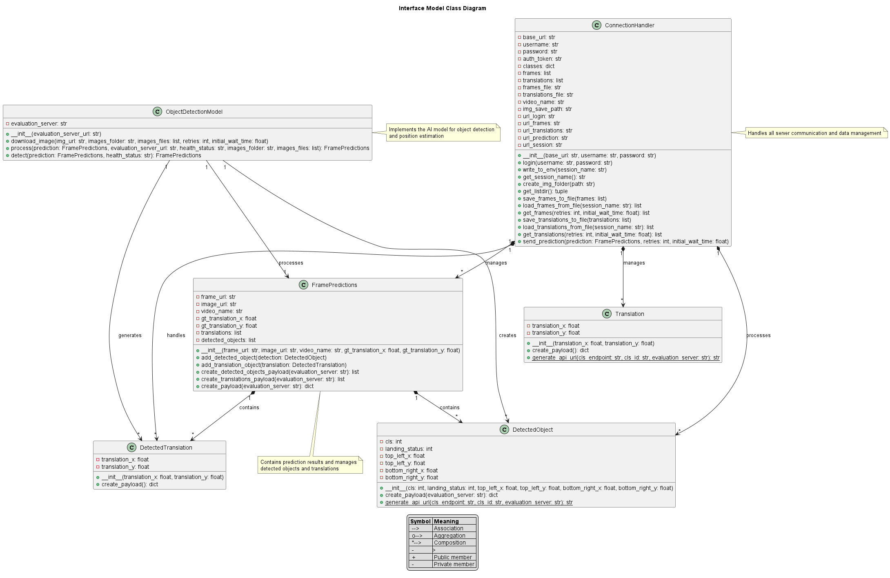

# SkyVis - Aerial Object Detection System

<div align="center">



**Real-time Object Detection and Position Estimation for Aerial Surveillance**

[](LICENSE)
[](https://python.org)
[](https://ultralytics.com)

*Teknofest AI in Transportation Competition Submission*

</div>

## 🎯 Project Overview

SkyVis is a sophisticated aerial surveillance system developed for the **Teknofest AI in Transportation Competition**. The system performs real-time object detection and camera position estimation from aerial imagery, connecting to a competition evaluation server to process frames and submit predictions.

### Key Features

- 🚁 **Real-time Object Detection**: YOLO-based detection of vehicles, humans, and aircraft
- 📍 **Position Estimation**: Optical flow-based camera movement tracking
- 🌐 **Server Integration**: Seamless connection to competition evaluation server
- ⚡ **Performance Optimized**: 3 FPS processing with efficient caching
- 🎯 **Landing Zone Classification**: Automated assessment of landing suitability

## 🏗️ System Architecture

```
┌─────────────────┐    ┌──────────────────┐    ┌─────────────────┐
│   Competition   │────│   SkyVis Core    │────│   AI Models     │
│     Server      │    │     Pipeline     │    │   (YOLO+CV)     │
└─────────────────┘    └──────────────────┘    └─────────────────┘
         │                       │                       │
    ┌────▼────┐             ┌────▼────┐             ┌────▼────┐
    │ Frames  │             │ Process │             │ Detect  │
    │Download │             │ & Cache │             │& Track  │
    └─────────┘             └─────────┘             └─────────┘
```

### Core Components

| Component | Description | Modifiable |
|-----------|-------------|------------|
| `main.py` | Entry point and orchestration | ❌ |
| `src/object_detection_model.py` | YOLO inference and processing | ✅ |
| `src/connection_handler.py` | Server communication | ❌ |
| `src/position_estimator.py` | Optical flow tracking | ❌ |
| `scripts/training.ipynb` | Model training pipeline | ✅ |

## 🚀 Quick Start

### Prerequisites

- Python 3.8
- NVIDIA GPU (recommended)
- Anaconda/Miniconda

### Installation

1. **Clone the repository**
   ```bash
   git clone https://github.com/Inaolol/skyvis.git
   cd skyvis
   ```

2. **Create virtual environment**
   ```bash
   conda create -n yarisma python=3.8
   conda activate yarisma
   ```

3. **Install dependencies**
   ```bash
   pip install -r requirements.txt
   ```

4. **Configure credentials**
   
   Create `config/.env` with your competition credentials:
   ```env
   TEAM_NAME=your_team_name
   PASSWORD=your_password
   EVALUATION_SERVER_URL="https://competition-server-url"
   SESSION_NAME=your_session_name
   ```

5. **Run the system**
   ```bash
   python main.py
   ```

## 🔧 Development Workflow

### Model Training

Use the provided Jupyter notebook for training custom YOLO models:

```bash
jupyter notebook scripts/training.ipynb
```

### Dataset Utilities

The `scripts/` directory contains useful tools:

- `folder2textYolo.py` - Generate train/validation splits
- `visualize_yolo.py` - Visualize annotations
- `Voc_2_yolo.py` - Convert VOC format to YOLO

### Model Integration

**⚠️ Competition Rule**: Only modify `src/object_detection_model.py`

Update the model path in the ObjectDetectionModel class:
```python
self.model = YOLO("path/to/your/best.pt")
```

## 📊 Object Classes & Detection

### Supported Objects

| Turkish Name | English | Class ID | Description |
|--------------|---------|----------|-------------|
| Tasit | Vehicle | 0 | Cars, trucks, etc. |
| Insan | Human | 1 | People detection |
| UAP | UAV | 2 | Unmanned Aerial Vehicle |
| UAI | UAI | 3 | Unmanned Aerial Infrastructure |

### Landing Status Classification

| Turkish | English | Code | Description |
|---------|---------|------|-------------|
| Inilebilir | Landable | "1" | Safe landing zone |
| Inilemez | Not Landable | "0" | Unsafe for landing |
| Inis Alani Degil | Not Landing Area | "-1" | Not a landing area |

## 🎛️ Configuration

### Camera Calibration

The system uses pre-calibrated camera parameters from `Calibration Parameters.txt`:
- **Focal Length**: 1413.3 x 1418.8 pixels
- **Principal Point**: (950.06, 543.38)
- **Distortion**: Radial and tangential correction

### Performance Settings

- **Target FPS**: 3.0 (competition requirement)
- **Image Resize**: 50% for performance
- **YOLO Config**: `conf=0.4, imgsz=800, device=0`

## 📁 Project Structure

```
skyvis/
├── 📄 main.py                 # Entry point
├── 📁 src/                    # Core modules
│   ├── object_detection_model.py  # 🔧 Main development file
│   ├── connection_handler.py      # Server communication
│   ├── position_estimator.py      # Camera tracking
│   ├── constants.py               # Object classes
│   └── ...
├── 📁 scripts/                # Development tools
│   ├── training.ipynb             # Model training
│   ├── visualize_yolo.py          # Annotation viewer
│   └── ...
├── 📁 runs/                   # Training outputs
│   └── train/weights/best.pt      # Trained model
├── 📁 _images/                # Cached frames
├── 📁 config/                 # Configuration
│   └── .env                       # Credentials
└── 📄 requirements.txt        # Dependencies
```

## 🏆 Competition Guidelines

### Rules & Constraints

- ✅ **Modifiable**: `object_detection_model.py`, training scripts
- ❌ **Protected**: Server communication, position estimation
- ⏱️ **Performance**: Must maintain 3 FPS processing
- 🔄 **Real-time**: Frame-by-frame server communication

### Submission Format

The system automatically formats predictions as:
- Bounding boxes with landing status
- Position translations
- JSON payload for server submission

## 🛠️ Technical Details

### Dependencies

- **Computer Vision**: OpenCV, Ultralytics YOLO
- **Deep Learning**: PyTorch (via Ultralytics)
- **Communication**: Requests, Python-decouple
- **Processing**: NumPy, Pillow, tqdm

### Performance Optimization

- **Caching**: Local frame storage to avoid re-downloads
- **Resize**: 50% image reduction for faster processing
- **GPU**: CUDA acceleration for YOLO inference

## 📈 Monitoring & Logging

The system generates detailed logs in `_logs/` directory:
- Frame download status
- Detection results
- Server communication
- Error handling

## 🤝 Contributing

This is a competition project with specific modification constraints. For development:

1. Focus changes on `src/object_detection_model.py`
2. Use training scripts for model improvements
3. Test with competition server interface
4. Follow the established data formats

## 📜 License

This project is licensed under the MIT License - see the [LICENSE](LICENSE) file for details.

## 🏅 Competition

**Teknofest AI in Transportation Competition**
- Real-time aerial object detection
- Position estimation and tracking
- Landing zone assessment

---

<div align="center">
  <strong>Built for Teknofest 2024 🇹🇷</strong>
</div>

